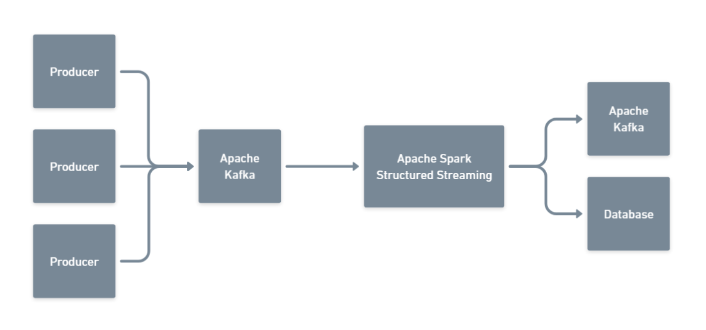
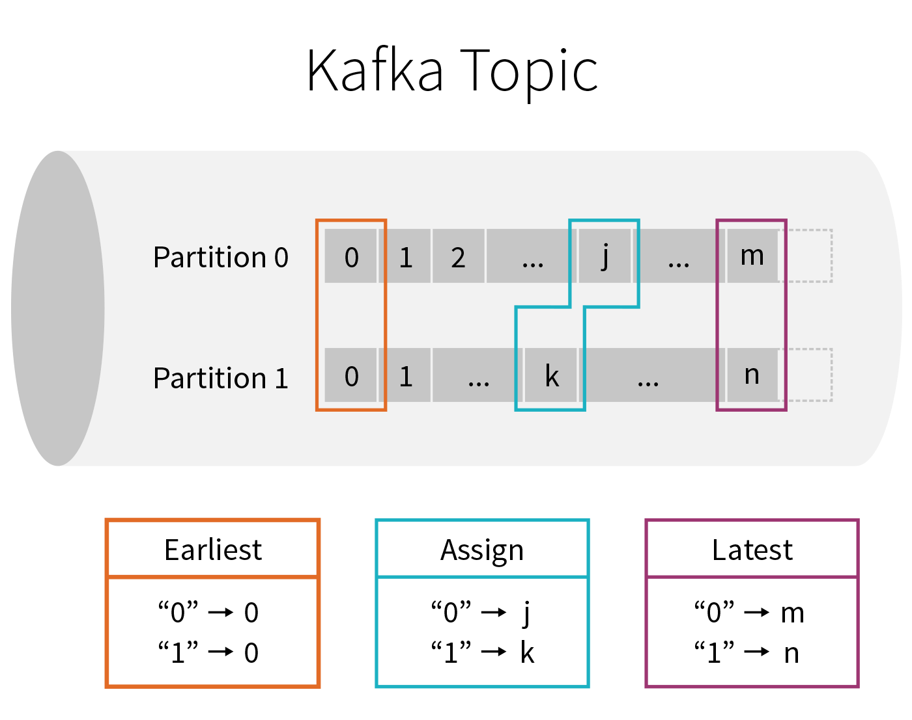

<style scoped>
h1 { font-size: 1.5rem }

p { font-size: 80% }
</style>

Pontifical Catholic University of Rio Grande do Sul<br>Graduate Program in Computer Science

# Data Stream Processing with Apache Kafka<br>and Spark Structured Streaming

Carlos Henrique Kayser<br>Email: carlos.kayser@edu.pucrs.br

Scalable Data Stream Processing<br>Prof. Dr. Dalvan Jair Griebler

May 15th, 2022

---

<style> 
h1 { font-size: 1rem }

p { font-size: 80% }

li { font-size: 80% }

pre code { font-size: 50% }

img[alt~="center"] {
  display: block;
  margin: 0 auto;
}

figcaption {
  display: block;
  margin: 0 auto;
}
</style>

# Introduction

- In the big data era, large volumes of data are generated every day

- According to Marr in 2018, 2.5 quintillion bytes of data were created each day [7]

- In order to extract useful insights, this data needs to be analyzed

- In this way, efficient Data Stream Processing Systems (DSPSs) have become essential [6]


---
# Introduction

- With all of this data, many organizations want to make their processes data-driven
  - In order to reduce costs and be more competitive

- One great example could be the **advertisement market**

- Predict **whether an ad will be clicked or not** could reduce costs and increase profits

- However, processing a large volume of events in **real-time** is a challenge


---

# System proposal

- To takle the scenario presented, a possible architectural solution could be:
  - Apache Kafka to handle user-generated events;
  - Apache Spark Structured Streaming to apply a predictive machine learning model to the data stream
    - i.e., to predict whether an ad will be clicked or not




<!-- To takle the scenario presented, a possible solution consists of applying a machine learning model (i.e., predict whether an ad will be clicked or not) with Apache Spark Structured Streaming in real-time on the data stream coming from Apache Kafka;     -->


---
# Apache Kafka Basics

- Kafka is a distributed event streaming platform
- The data is organized into _topics_ (e.g., tweets, orders)
  - To enable parallelism, they are split into _partitions_
- A _producer_ append data/messages to _topics_
- A _consumer_ read data from _topics_
  - They also can _subscribe_ to a _topic_ and receive incoming records as they arrive

<!-- 

*Fig.1 - 4K Mountains Wallpaper* 
 -->


---

# Apache Spark Structured Streaming Basics

- Structured Streaming is a scalable and fault-tolerant stream processing engine
- It provides a unified batch and streaming API that enables us to interact with data published to Kafka as a DataFrame
  - i.e., it is possible to use the same code for batch or streaming
- It ensures end-to-end exactly-once fault-tolerance guarantees through _checkpointing_ and _write-ahead logs_
- Structured Streaming queries are processed using a _micro-batch_ processing engine (default)
  - i.e., _micro-batch_ starts as soon as the previous one ends


---
# Reading data from Kafka


- The following PySpark code read data from the `demo` Kafka topic (*subscribe*)
- It reads the data in a streaming way (*startingOffsets*)
  - "latest" to read only the new messages
  - "earliest" to read all messages that have not been processed

```python
df = spark \
  .readStream \
  .format("kafka") \
  .option("kafka.bootstrap.servers", KAFKA_HOST) \
  .option("subscribe", "demo") \
  .option("startingOffsets", "latest") \
  .load()
```


---
# Writing data to Kafka

- When writing data, Apache Spark requires a `checkpointLocation` to store all data related to the execution
  - In case of failure or shutdown, it is possible to recover the previous progress and state
- The command below writes data to the `demo` Kafka topic. 

```python
df.selectExpr("CAST(key AS STRING)", "CAST(value AS STRING)") \
  .writeStream \
  .format("kafka") \
  .option("kafka.bootstrap.servers", KAFKA_HOST) \
  .option("topic", "demo") \
  .option("checkpointLocation", "checkpointLocation") \
  .start()
```


---
# Writing data to not supported output sink

- Foreach Sink
  - Allows custom write logic on every row
  - Fault-tolerant: at-least-once
- ForeachBatch Sink
  - Allows arbitrary operations and custom logic on the output of each micro-batch
  - Reuse existing batch data sources
  - Write to multiple locations
  - Fault-tolerant: Depends on the implementation


---
# Writing data to not supported output sink

Example of writing data in PostgreSQL:

```python
def foreach_batch_function(df, epoch_id):

    df.write \
      .format("jdbc") \
      .option("url", "jdbc:postgresql://localhost:5432/postgres") \
      .option("driver", "org.postgresql.Driver") \
      .option("dbtable", "predictions") \
      .option("user", "postgres") \
      .option("password", "postgres") \
      .mode("append") \
      .save()

df \
  .writeStream \
  .foreachBatch(foreach_batch_function) \
  .option("checkpointLocation", "checkpointLocation") \
  .start()
```


---
# Demonstration

- Testbed
  - minikube

- Apache Kafka on Kubernetes with Strimzi Operator
  - Apache Kafka Topics

- Producer (python application)
  - It sends events to Apache Kafka

- Apache Spark ML Training Notebook (jupyter)

- Apache Spark Structured Streaming Notebook (jupyter)


---
# Conclusions

- In conclusion, implementing code using Spark API is easy
  - Uses the same API for batch or streaming

- Integration with Apache Kafka is easy

- It is simple to scale the solution to support a larger number of messages

- In addition, Apache Spark Structured Streaming is used in a production environment of big techs [1]


---
# References

<style scoped>
p { font-size: 65% }
</style>

[1] Armbrust, Michael, et al. "Structured streaming: A declarative API for real-time applications in apache spark." _Proceedings of the 2018 International Conference on Management of Data_. 2018.

[2] Apache Spark. "Structured Streaming Programming Guide". Source: https:
//spark.apache.org/docs/3.2.1/structured-streaming-programming-
guide.html, June 2022.

[3] Apache Spark. "Structured Streaming + Kafka Integration Guide". Source: https://spark.apache.org/docs/3.2.1/structured-streaming-kafka-integration.html, June 2022.

[4] Apache Kafka. "Apache Kafka Documentation". Source: https://kafka.apache.org/32/documentation.html, June 2022.

[5] Das, Tathagata, et al. "Processing Data in Apache Kafka with Structured Streaming in Apache Spark 2.2". Source: https://databricks.com/blog/2017/01/19/real-time-streaming-etl-structured-streaming-apache-spark-2-1.html, June 2022.

[6] Eskandari, Leila, et al. "I-Scheduler: Iterative scheduling for distributed stream processing systems." _Future Generation Computer Systems_ 117 (2021): 219-233.

---
# References

<style scoped>
p { font-size: 65% }
</style>

[7] Marr, Bernard. “How Much Data Do We Create Every Day? The Mind-Blowing Stats Everyone Should Read”. Forbes. May 21st, 2018


<!-- <p>
    
</p>
<p>
    <em>image_caption</em>
</p> -->


<!-- <figure class="image">
  
  <figcaption>Kafka Topic</figcaption>
</figure> -->


<!-- 
---
<style>
.image-caption {
  text-align: center;
  font-size: .8rem;
  color: light-grey;
}
</style>


<figcaption>Kafka Topic</figcaption> -->


<!-- 
---

# Apache Spark Structured Streaming

[1] -->

